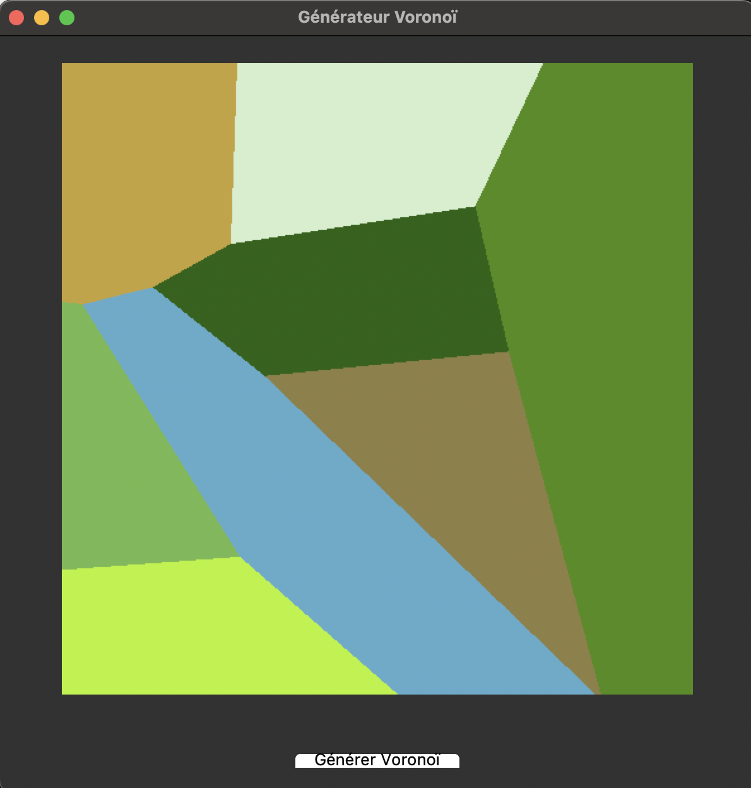

# SAE S6 : Diagramme de Voronoi - Phase 1 

## Lancement du programme première fois 

- sudo apt install python3-tk
- pip install Pillow
- python3 gui.py

## Lancement du programme 
- python3 gui.py

## Fonctionnalités 

- Lecture des fichiers : Importe des listes de points quand on ouvre un fichier .txt adapté
- Calcul : Calcul des distances avec les points 1 à 1
- test 

## Résultat obtenu 

