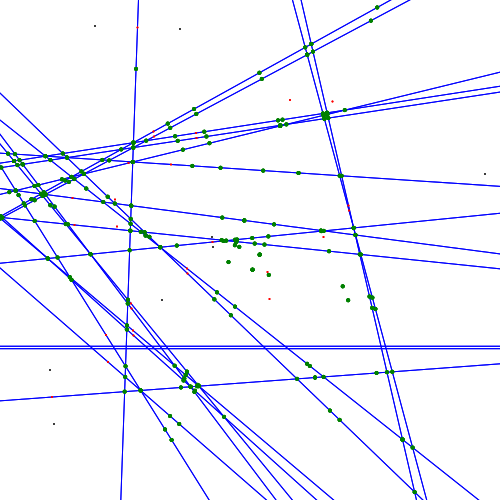

# SAE S6 : Diagramme de Voronoi - Phase 1 

## Fonctionnalités 👀

- Lecture des fichiers : Importe des listes de points quand on ouvre un fichier .txt adapté
- Calcul : Calcul des médiatrices et des intersections possible de Voronoi
- SVG : Export de l'image en format SVG avec les intersections, vecteurs, points etc

## Pourquoi un échec ? 😞

L'idée était de "simplifier" le concept de Voronoi en calculant petit à petit pleins d'étapes jusqu'à ne garder à la fin que les zones de Voronoi. 
- Problème rencontré : Le filtrage des intersections s'est avéré plus compliqué que prévu, et on ne sait pas comment on aurait continué après cette étape.
- Resultat : On a mit de côté cette approche pour aller sur une version Brute Force

## Qu'est ce que ça fait actuellement ? ⚙️

Le programme dans son état actuel permet de générer l'ensemble des médiatrices pour chaque paires de points et il vas calculer les intersections et afficher sous format SVG.
C'est déjà un vrai défi mathématique en soit. 

## Le rendu 🖼️
- ⚫ En noir, les points de départ.
- 🔴 En rouge, le centre (Que j'ai simplifié le nom par point médiatrice) entre deux points du fichier donné.
- 🟢 En vert, les intersections.
- 🔵 En bleu, le vecteur qui sépare deux points noir en passant par le point médiatrice rouge des deux points.

